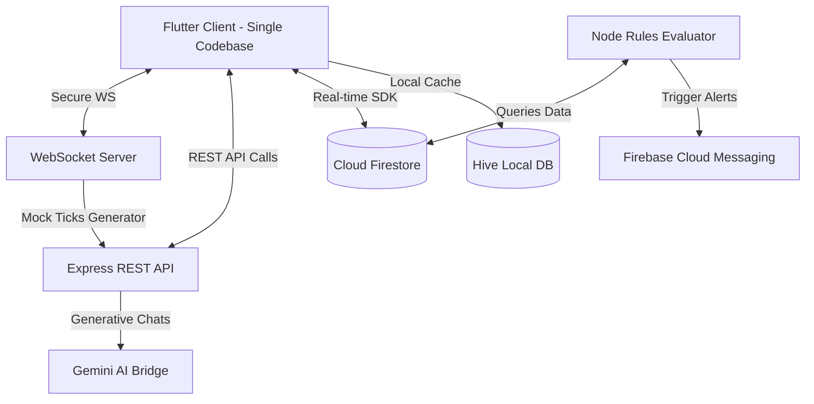
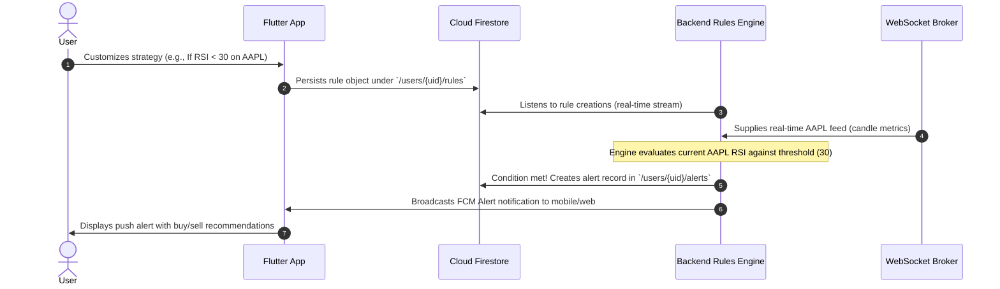

# System Architecture & Design Specification

This document details the system design, modular layers, data flows, and runtime lifecycle of the TradeMentor application.

---

## 🏛️ System Component Topology

The system comprises a modular architecture that cleanly separates client UI, local state storage, real-time networking, background rules processing, and the AI intelligence service.

### 1. The Frontend Client (Flutter)
- **Multi-Platform Support**: Built from a single Flutter codebase that compiles to Web (responsive SPA) and Android (Release APK).
- **Presentation Pattern**: Clean Architecture structure separating UI Views (Screens) from State Providers and Service Connectors.
- **State Framework**: Riverpod for reactive dependency injection and screen binding.
- **Local Cache**: Hive Database for fast offline access to watchlist preferences, caching stock lists, and saving active chat histories.

### 2. The Backend Server (Node.js & Express)
- **WebSocket Broker**: Pushes simulated mock ticks and technical metrics to connected web and mobile clients every 2 seconds.
- **REST Endpoints**: Serves chat parsing, order logging, subscription management, and admin rules execution control.
- **AI Chatbot Bridge**: Proxies questions to the Google Gemini model using secure environmental API keys, appending structural prompts for stock analysis and risk evaluations.

### 3. Database & Message Bus (Firebase)
- **Firebase Authentication**: Handles OTP-based authentication, user register, and logins securely.
- **Cloud Firestore**: Holds persistent structures including user portfolios, active watchlists, customized user rules, and historic notifications.
- **Firebase Cloud Messaging (FCM)**: Sends high-priority push notifications directly to the Android client when a rule condition is met.

---

## 🏗️ Flutter Clean Architecture Directory Structure

The Flutter application (`mobile_app/`) is designed with a strict layer separation:

1. **`core/`**: Central utilities including global themes (Light & Dark HSL tables), router pathways using `GoRouter`, API network clients, and shared constant configuration files.
2. **`models/`**: Strongly-typed JSON serializable Dart objects for `Stock`, `RuleCondition`, `TriggeredAlert`, `ChatMessage`, and `Holdings`.
3. **`services/`**: Stateless wrappers encapsulating external interactions (e.g. Firebase endpoints, Hive disk reads, HTTP fetch, WebSocket subscriptions).
4. **`providers/`**: Riverpod state providers representing application state machines (e.g. watchlist controllers, active rules collection, trade ordering streams).
5. **`views/`**: Decoupled presentation UI files grouped by feature modules. No views execute raw business logic; instead, they interact purely with `ref.watch` or `ref.read`.

---

## 🔄 Rule-Based Trading Assistance Engine Lifecycle

Unlike execution bots, TradeMentor's engine acts as an **advisor**. Below is the sequence of events showing how a rule condition is evaluated:

1. **Rule Setup**: The user builds conditions using a visual interface in `RuleBuilderScreen`.
2. **Persistence**: The rule is stored in Firestore.
3. **Continuous Monitoring**: The backend rules engine reads incoming stock prices and calculates technical indicators (RSI, moving averages).
4. **Evaluation**: The backend checks rules against calculated metrics.
5. **Alert Emission**: If conditions are satisfied, an alert is logged in Firestore, and an FCM payload is sent.
6. **Delivery**: The client receives a visual push notification. Tapping the notification displays recommendations along with technical summary data.
