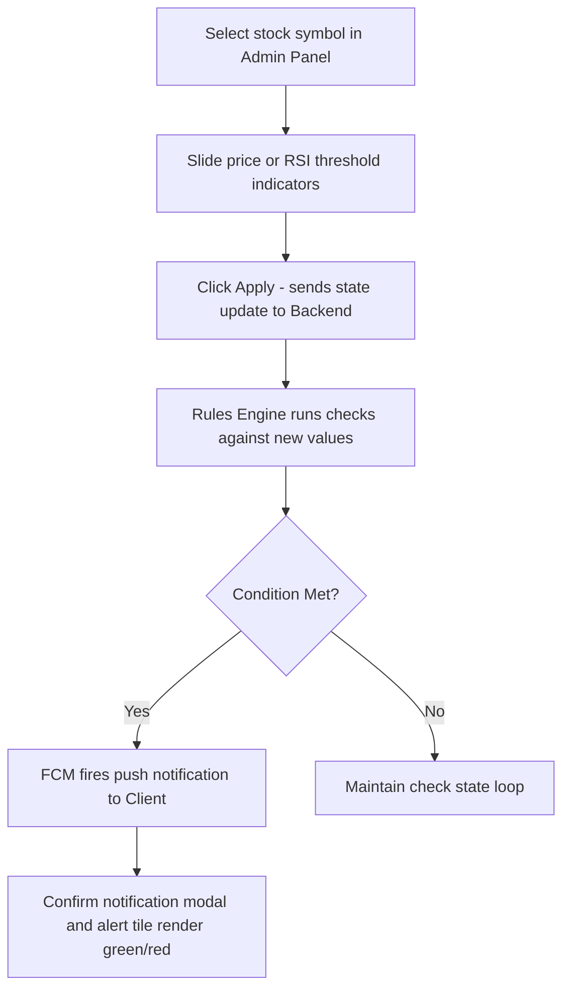

# Quality Assurance & Testing Plan

This document outlines the testing strategy, test cases, and simulation plans to verify the components of the TradeMentor platform.

---

## 🧪 1. Testing Framework Matrix

We test TradeMentor across three key levels:

| Test Level | Scope | Tech Stack | Key Target |
| :--- | :--- | :--- | :--- |
| **Unit Testing** | Technical indicators calculations, condition checks, serialization models | Dart Test, Mocha (Backend) | Verify `RulesEngineService` and data parser models |
| **Widget Testing** | UI responsiveness, glassmorphic layout, buttons, theme transitions | Flutter Test | Ensure `GlassContainer` and charts render cleanly on Web/Mobile |
| **Integration Testing** | Authentic logins, route transitions, database updates, real WebSocket feeds | Integration Test | Validate GoRouter state and Cloud Firestore data synchronization |

---

## 🛠️ 2. Automated Test Definitions

### Test Case UT-01: Rule Condition Validation (Less Than)
* **Target**: Validate that a stock price lower than the threshold correctly returns `true`.
* **Input**:
  - Indicator: `Price`
  - Comparison: `LESS_THAN`
  - Threshold: `150.00`
  - Current price: `145.20`
* **Assert**: `RulesEngine.evaluate(condition, price) == true`

### Test Case UT-02: RSI Crosses Below Validation
* **Target**: Validate complex boundary crossovers.
* **Input**:
  - Historic RSI values: `[34.5, 31.2, 28.4]`
  - Indicator: `RSI`
  - Comparison: `CROSSES_BELOW`
  - Threshold: `30.00`
* **Assert**: `RulesEngine.evaluateCrossover(condition, history) == true`

### Test Case WT-01: GlassContainer Responsiveness
* **Target**: Check visual rendering and constraints.
* **Checks**:
  - Verifies that BackdropFilter does not crash when container width is animated.
  - Verifies that border opacity conforms to HSL theme configurations.

---

## 🎛️ 3. Simulated Manual Verification (The Administrator Testbed)

To ensure the rules engine triggers alerts and sends notifications correctly without real-time market dependency, we use the `MockMarketControlScreen` inside the app's Admin Panel.

### Protocol for Simulator Verification:
1. Log in to the application and create a rule:
   - Asset: `TSLA`
   - Condition: `Price GREATER_THAN 300.00`
2. Open the Admin Panel from the sidebar.
3. Access the **Mock Market Control** console.
4. Select `TSLA` and slide the price controls to `305.00`.
5. Tap **Apply Mock Updates**.
6. **Pass Criteria**:
   - The user's screen receives a toast notification.
   - The notification counter increases in the App Bar.
   - Opening the **AlertHistoryScreen** displays: *"TSLA price breached threshold $300.00, current: $305.00"*.
